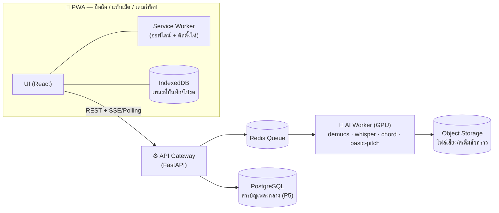

# 🌊 AquaChord

> **แกะคอร์ดกีตาร์ แท็บ และเนื้อเพลงจากลิงก์วิดีโอหรือไฟล์เสียง ด้วย AI — ฟังเสียงโน้ตได้ แก้ไขได้ ติดตั้งบนมือถือ/แท็บเล็ตได้ (PWA)**

โทนดีไซน์: **น้ำฟ้ามรกตใส** ฟองอากาศลอยเป็นแบ็คกราวด์ สดชื่น สบายตา
(UI/UX ออกแบบเสร็จแล้ว — เอกสารชุดนี้คือ "พิมพ์เขียวทางเทคนิค" ให้ทีมพัฒนาลงมือทำต่อได้ทันที)

---

## 1. ภาพรวมฟีเจอร์

| ฟีเจอร์ | คำอธิบาย | เฟส |
|---|---|---|
| 🔗 แกะเพลงจาก URL | วางลิงก์ (เช่น YouTube) → AI ถอดคอร์ด + เนื้อเพลง + แท็บ | P3 |
| 📂 แกะเพลงจากไฟล์ | อัปโหลด mp3 / wav / m4a / flac / ogg / opus | P3 |
| 🎸 คอร์ด + เนื้อเพลง | แสดงคอร์ดเหนือเนื้อร้อง (ChordPro), เปลี่ยนคีย์ (transpose), capo | P1 |
| 🎼 แท็บกีตาร์รายแทร็ก | แยกแทร็ก (ร้อง/กีตาร์/เบส/กลอง) แล้วเจนแท็บ + โน้ต | P3 |
| 🔊 กดฟังเสียงโน้ต | แตะคอร์ด/โน้ตในแท็บ → เล่นเสียงผ่าน Web Audio (ออฟไลน์ได้ ไม่ต้องโหลดไฟล์เสียง) | P1 |
| ✏️ แก้ไขได้ | แก้คอร์ด เนื้อร้อง แท็บ ใน Editor พร้อมพรีวิวสด | P2 |
| 💾 บันทึกเพลง | เพลงที่เล่นบ่อย รายการโปรด ประวัติการเล่น — เก็บออฟไลน์ใน IndexedDB | P1 |
| 📚 สารบัญเพลง | รายชื่อเพลงพร้อมชื่อผู้สร้าง/ผู้แกะ ค้นหาได้ | P1 (local) / P5 (แชร์กลาง) |
| ⚠️ คำเตือนลิขสิทธิ์ | แจ้งเตือนก่อนแกะ/ก่อนเผยแพร่ ดู [docs/07](docs/07-COPYRIGHT-POLICY.md) | P1 |
| 📱 ติดตั้งเป็นแอป | PWA — Add to Home Screen ได้ทั้ง Android / iOS / แท็บเล็ต / เดสก์ท็อป | P1 |

---

## 2. สถาปัตยกรรมโดยรวม



- **ฝั่ง client เป็น offline-first**: เพลงที่แกะแล้วถูกเก็บใน IndexedDB เปิดดู/เล่น/แก้ไขได้โดยไม่ต้องต่อเน็ต — backend จำเป็นเฉพาะตอน "แกะเพลงใหม่" กับ "สารบัญกลาง"
- **งานแกะเพลงเป็น async job**: ยิง job → poll/SSE ดูความคืบหน้าเป็นขั้น ๆ (แยกเสียง → คอร์ด → เนื้อร้อง → แท็บ) → ได้ `SongDoc` กลับมา
- รายละเอียดเต็ม: [docs/01-ARCHITECTURE.md](docs/01-ARCHITECTURE.md)

---

## 3. Tech Stack ที่แนะนำ (พร้อมทางเลือก)

| ส่วน | แนะนำ | ทางเลือก | เหตุผลที่แนะนำ |
|---|---|---|---|
| Frontend | **Vite + React 19 + TypeScript** | Next.js (ถ้าต้องการ SEO สารบัญสาธารณะใน P5) | เบา เร็ว ทีมหาคนทำง่าย ไม่ต้องมี server-side |
| PWA | **vite-plugin-pwa** (Workbox) | manual SW | จัดการ precache/update ให้อัตโนมัติ |
| State | **Zustand** (+persist) | Redux Toolkit | เล็ก เรียนรู้เร็ว |
| Local DB | **Dexie (IndexedDB)** + dexie-react-hooks | localForage | query/index ได้จริง เหมาะกับสารบัญเพลง |
| เสียงโน้ต | **Web Audio API + Karplus-Strong synth** | smplr / soundfont-player | ไม่ต้องมีไฟล์เสียง ทำงานออฟไลน์ 100% เสียงเหมือนดีดสายจริง |
| แสดงแท็บ | **SVG component ของเราเอง (MVP)** | alphaTab (P3+ ได้ playback + Guitar Pro) | คุม UI ตามดีไซน์ได้เต็มที่ก่อน แล้วค่อยอัปเกรด |
| Backend API | **FastAPI (Python 3.11)** | Node/NestJS | ecosystem ML เป็น Python ทั้งหมด — ลดการข้ามภาษา |
| Queue | **Redis + RQ** | Celery | ง่ายพอสำหรับ job ยาว 1–5 นาที |
| แยกเสียง | **Demucs v4 (htdemucs_ft)** | Spleeter | คุณภาพดีที่สุดที่เป็น open source |
| ตรวจคอร์ด | **madmom (CNN + CRF)** | autochord (ง่ายสุด) / BTC / Chordino | แม่นและ smooth ตามจังหวะ |
| ถอดเนื้อเพลง | **faster-whisper (large-v3)** | WhisperX (ต้อง align ละเอียด) | รองรับภาษาไทยดี + word timestamps |
| โน้ต→MIDI | **basic-pitch (Spotify)** | CREPE | เบา ใช้ง่าย polyphonic ได้ |
| DB (server) | **PostgreSQL** | SQLite (dev) | สารบัญกลาง + ผู้ใช้ใน P5 |
| Storage | **Cloudflare R2 / S3** | local disk (dev) | ไฟล์เสียง/สเต็มชั่วคราว |
| Deploy | **Docker Compose บน VPS + GPU** | RunPod/Modal/Replicate (เช่า GPU ราย job) | ดู [docs/01 §5](docs/01-ARCHITECTURE.md) |

> 💡 **ไม่มี GPU / ไม่อยากทำ ML เอง?** มีแผนสำรองใช้ managed API (Moises/Music.AI, Klangio, Replicate) — เปรียบเทียบไว้ใน [docs/02 §10](docs/02-AI-PIPELINE.md)

---

## 4. โครงสร้าง repo ที่วางไว้ (เมื่อเริ่มโค้ด)

```
aquachord/
├── README.md                 ← ไฟล์นี้
├── docs/                     ← พิมพ์เขียวทั้งหมด (อ่านก่อนเริ่ม!)
├── web/                      ← PWA (Vite + React + TS)
│   ├── src/
│   │   ├── pages/            Home · Library · SongView · Editor · Settings
│   │   ├── components/       ChordSheet · ChordDiagram · TabView · JobProgress ...
│   │   ├── lib/              chordpro.ts · music.ts · audio.ts · transpose.ts
│   │   ├── store/            settings.ts (Zustand) · library.ts (Dexie)
│   │   ├── api/              client.ts (+ demo mode ไม่ต้องมี backend)
│   │   └── data/             เพลงเดโม
│   └── public/icons/         ไอคอน PWA (192/512/maskable/apple-touch)
├── server/                   ← FastAPI + AI pipeline
│   ├── app/
│   │   ├── main.py           FastAPI app + CORS
│   │   ├── routers/          jobs.py · songs.py
│   │   ├── pipeline/         ingest · separate · chords · lyrics · tabs · assemble
│   │   ├── schemas.py        Pydantic models (ตรงกับ docs/04)
│   │   └── store.py          DB layer
│   ├── requirements.txt      ← ตัว API (เบา)
│   ├── requirements-ml.txt   ← ตัว ML (หนัก แยกติดตั้ง)
│   └── Dockerfile
├── docker-compose.yml
└── .github/workflows/ci.yml
```

---

## 5. เริ่มต้นสำหรับทีมพัฒนา

**ลำดับการอ่านเอกสาร (สำคัญ):**

| # | เอกสาร | ใครต้องอ่าน |
|---|---|---|
| 1 | [01-ARCHITECTURE.md](docs/01-ARCHITECTURE.md) — สถาปัตยกรรม, deployment, security | ทุกคน |
| 2 | [04-DATA-FORMAT.md](docs/04-DATA-FORMAT.md) — SongDoc / ChordPro / TabDoc (**สัญญากลางของทั้งระบบ**) | ทุกคน |
| 3 | [03-API-SPEC.md](docs/03-API-SPEC.md) — REST/SSE spec | FE + BE |
| 4 | [05-FRONTEND-GUIDE.md](docs/05-FRONTEND-GUIDE.md) — วิธี implement แต่ละจอ + เสียงโน้ต + PWA | FE |
| 5 | [02-AI-PIPELINE.md](docs/02-AI-PIPELINE.md) — โมเดล AI ทีละขั้น + โค้ดตัวอย่าง | BE/ML |
| 6 | [06-ROADMAP.md](docs/06-ROADMAP.md) — แผนงานเป็นเฟส + เกณฑ์ตรวจรับ | PM + ทุกคน |
| 7 | [07-COPYRIGHT-POLICY.md](docs/07-COPYRIGHT-POLICY.md) — นโยบายลิขสิทธิ์ + ข้อความพร้อมใช้ในแอป | ทุกคน |
| 8 | [08-CONTRIBUTING.md](docs/08-CONTRIBUTING.md) — กติกา branch/PR/CI/review | ทุกคน |

**หัวใจของการเริ่มงานแบบไม่ติดกัน:**
1. FE เริ่มได้ทันทีด้วย **Demo Mode** (mock pipeline ในไฟล์ `api/client.ts` — ไม่ต้องรอ backend) ต่อ UI/UX ที่มีอยู่เข้ากับ `SongDoc` เดโม
2. BE เริ่มจาก **Fake Pipeline** (`PIPELINE_MODE=fake` — job วิ่งครบทุก stage แต่คืนเพลงเดโม) เพื่อให้ FE ต่อ API จริงได้ก่อนที่โมเดล ML จะพร้อม
3. ML ทำ pipeline จริงคู่ขนานไป แล้วสลับ `PIPELINE_MODE=real` เมื่อพร้อม — **สัญญาข้อมูล (SongDoc) ไม่เปลี่ยน**

**MVP (นิยามชัด ๆ):** วาง URL หรืออัปโหลดไฟล์ → ได้คอร์ด + เนื้อเพลง (ChordPro) → เปิดดู เปลี่ยนคีย์ ฟังเสียงคอร์ด แก้ไข บันทึกลงเครื่อง → ติดตั้งเป็นแอปได้ (แท็บกีตาร์ = เฟสถัดไป)

---

## 6. ⚠️ ลิขสิทธิ์ (ต้องอ่าน)

เพลงส่วนใหญ่มีลิขสิทธิ์ (ทั้งดนตรีกรรมและเนื้อร้อง) — AquaChord ออกแบบมาเพื่อ **การเรียนรู้และใช้ส่วนตัว**:
- ผลการแกะเพลงถูกเก็บ **ส่วนตัวบนเครื่องผู้ใช้เป็นค่าเริ่มต้น** ไม่เผยแพร่อัตโนมัติ
- ต้องแสดงคำเตือนก่อนเริ่มแกะและก่อนแชร์สาธารณะ (ข้อความพร้อมใช้อยู่ใน [docs/07](docs/07-COPYRIGHT-POLICY.md))
- การดาวน์โหลดเสียงจาก YouTube อาจขัด Terms of Service — แนะนำให้ผู้ใช้อัปโหลดไฟล์ที่ตนมีสิทธิ์ใช้เป็นทางหลัก

---

## 7. เครดิต

- **Concept & Owner:** xjanova — <https://github.com/xjanova/aquachord>
- **UI/UX:** ออกแบบแล้ว (ส่งมอบแยก) — โทนน้ำฟ้ามรกตใส + ฟองอากาศ
- เอกสารสถาปัตยกรรมชุดนี้จัดทำเพื่อส่งมอบให้ทีมพัฒนา — อัปเดตล่าสุด 2026-07-05
