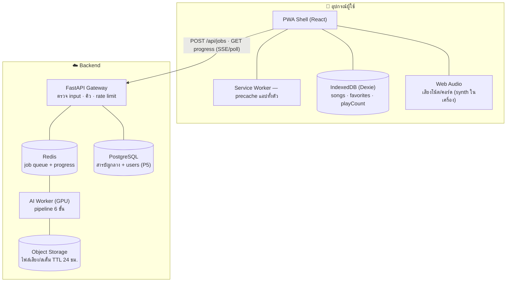
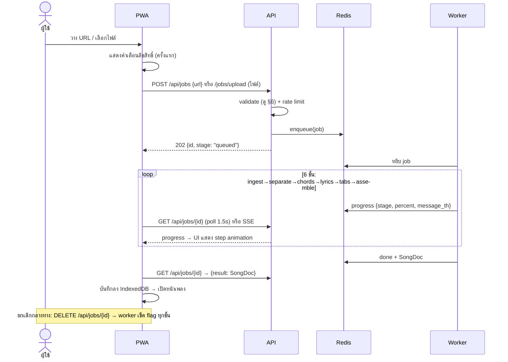

# 01 — สถาปัตยกรรมระบบ (Architecture)

> อ่านคู่กับ [04-DATA-FORMAT.md](04-DATA-FORMAT.md) (สัญญาข้อมูลกลาง) และ [03-API-SPEC.md](03-API-SPEC.md)

## 1. หลักการออกแบบ

1. **Offline-first** — เพลงที่แกะเสร็จแล้วเป็นสมบัติของผู้ใช้ เก็บใน IndexedDB บนเครื่อง เปิด/เล่น/แก้ไข/เปลี่ยนคีย์/ฟังเสียงโน้ตได้โดยไม่ต้องต่อเน็ต Backend จำเป็นเฉพาะ 2 อย่าง: แกะเพลงใหม่ (งาน AI) และสารบัญกลาง (เฟส 5)
2. **สัญญาข้อมูลเดียว (`SongDoc`)** — ทุกส่วนของระบบ (pipeline, API, editor, viewer, export) พูดภาษาเดียวกันผ่าน JSON schema ใน docs/04 → เปลี่ยนโมเดล AI ภายหลังได้โดย frontend ไม่ต้องแก้
3. **งาน AI เป็น async job เสมอ** — ห้าม block HTTP request (งานใช้เวลา 1–5 นาที) ใช้ queue + progress event
4. **แยก "ตัวแอป" กับ "ตัว ML"** — API gateway เบา (รันที่ไหนก็ได้) ส่วน worker หนัก (ต้องการ GPU) ขยาย/ย้าย/เช่า cloud ได้อิสระ

## 2. องค์ประกอบระบบ

| องค์ประกอบ | หน้าที่ | ไม่ใช่หน้าที่ |
|---|---|---|
| **PWA** | UI ทุกจอ, เก็บเพลง local, เล่นเสียงโน้ต, transpose, editor, export/import | ประมวลผลเสียง (ห้ามทำ ML ฝั่ง client ใน MVP) |
| **API Gateway** | รับ URL/ไฟล์, validate, สร้าง job, รายงาน progress, CRUD สารบัญกลาง | งาน ML ใด ๆ |
| **AI Worker** | รัน pipeline (docs/02), อัปเดต progress ลง Redis, เขียนผลเป็น SongDoc | รู้จัก HTTP/ผู้ใช้ |
| **Object Storage** | ไฟล์เสียงต้นทาง + สเต็มระหว่างประมวลผล — **ลบอัตโนมัติภายใน 24 ชม.** (ลด storage + ลดความเสี่ยงลิขสิทธิ์) | เก็บถาวร |

## 3. วงจรชีวิตของ Job (สำคัญที่สุดในระบบ)

**สถานะ job:** `queued → ingest → separate → chords → lyrics → tabs → assemble → done` หรือ `error` / `cancelled`
ทุก progress มี `message_th` (ข้อความไทยพร้อมแสดง) — frontend ไม่ต้องแปลเอง

## 4. Frontend Architecture (สรุป — รายละเอียดใน docs/05)

- **Routing:** `/` (แกะเพลง) · `/library` (สารบัญ) · `/song/:id` (ดูเพลง) · `/edit/:id` (แก้ไข) · `/settings`
- **State:** Zustand (settings, UI state ชั่วคราว) / Dexie (ข้อมูลเพลงถาวร ผ่าน `useLiveQuery` → UI อัปเดตอัตโนมัติเมื่อ DB เปลี่ยน)
- **Demo Mode:** ถ้าไม่ตั้ง `VITE_API_URL` → `api/client.ts` จำลอง job ครบทุก stage แล้วคืนเพลงเดโม → **ทีม FE พัฒนา UI ครบทุกจอโดยไม่ต้องมี backend เลย**
- **PWA:** precache ตัวแอปทั้งหมด (JS/CSS/font/icon) — เปิดออฟไลน์ได้เสมอ; ข้อมูลเพลงอยู่ IndexedDB ไม่ใช่ cache

## 5. ทางเลือกการ Deploy (เลือกตามงบและทีม)

| แบบ | องค์ประกอบ | ค่าใช้จ่ายโดยประมาณ | เหมาะกับ |
|---|---|---|---|
| **A. VPS เดียว + GPU** | Docker Compose: nginx + web static + api + redis + worker บนเครื่องมี GPU (เช่น RTX 3060 12GB) | เช่า GPU VPS ~1,500–3,000฿/เดือน หรือเครื่องที่ office | เริ่มต้น/beta — ง่ายสุด |
| **B. แยก worker ขึ้น cloud GPU ราย job** | Web+API บน VPS ธรรมดา / Cloudflare · worker บน RunPod/Modal serverless (จ่ายรายวินาที) | API ~200฿/เดือน + GPU ~0.5–2฿/เพลง | โหลดไม่สม่ำเสมอ — คุ้มสุด |
| **C. ไม่ทำ ML เอง** | เรียก managed API (ดู docs/02 §10) | ~3–15฿/เพลง | ทีมไม่มีคน ML / รีบออก MVP |

> แนะนำ: เริ่ม **A บนเครื่อง dev** (demucs+whisper รันบน CPU ได้แค่ช้า) → ขึ้น production ด้วย **B**
> หมายเหตุเครื่อง dev ปัจจุบันมี Python 3.9 — pipeline ต้องใช้ **Python 3.10+ (แนะนำ 3.11)** ให้ตั้ง venv/conda แยก

**Web hosting:** `web/dist` เป็น static ล้วน → วางที่ Cloudflare Pages / nginx ที่ไหนก็ได้ แต่ **ต้องเป็น HTTPS** (เงื่อนไขบังคับของ PWA/Service Worker)

## 6. Security Checklist (ต้องทำตั้งแต่ MVP — อย่าเลื่อน)

| ความเสี่ยง | มาตรการบังคับ |
|---|---|
| **SSRF ผ่าน URL เพลง** | อนุญาตเฉพาะ `http/https` · resolve DNS แล้ว**บล็อก IP ภายใน** (127.0.0.0/8, 10/8, 172.16/12, 192.168/16, 169.254/16, ::1) · จำกัด redirect · ใช้ allowlist โดเมน (youtube.com, youtu.be, soundcloud ฯลฯ) ในเฟสแรก |
| **อัปโหลดไฟล์อันตราย** | ตรวจนามสกุล + MIME + **magic bytes** · จำกัดขนาด (100MB) และความยาวเสียง (12 นาที) · สุ่มชื่อไฟล์ใหม่เสมอ (ห้ามใช้ชื่อจากผู้ใช้ — กัน path traversal) · ประมวลผลใน temp dir แยกราย job แล้วลบทิ้ง |
| **DoS / spam job** | rate limit ต่อ IP (เช่น 5 jobs/ชั่วโมง) · จำกัด job พร้อมกันต่อ IP = 1 · คิวมีเพดาน + คืน 429 |
| **Command injection** | เรียก ffmpeg/yt-dlp ผ่าน `subprocess` แบบ **argument list เท่านั้น** (`shell=False`) ห้ามต่อ string เด็ดขาด |
| **ข้อมูลหลุดใน error** | ผู้ใช้เห็นข้อความไทยทั่วไป ("แกะเพลงไม่สำเร็จ ลองใหม่อีกครั้ง") · stack trace ลง log ฝั่ง server เท่านั้น |
| **Secrets** | ทุก key อยู่ใน `.env` (มี `.env.example` ให้) — ห้าม commit, ห้ามส่งถึง client, ตรวจใน CI |
| **CORS** | allowlist เฉพาะโดเมนแอป (dev: localhost:5173) ไม่ใช้ `*` ใน production |
| **ไฟล์เสียงผู้ใช้** | ถือเป็นข้อมูลส่วนตัว: TTL 24 ชม., ไม่ log ชื่อเพลง/URL ร่วมกับ IP, endpoint สเต็มใช้ signed URL |

## 7. การขยายระบบในอนาคต (บันทึกไว้ ไม่ทำตอนนี้)

- **บัญชีผู้ใช้ + sync ข้ามเครื่อง (P5):** เพิ่ม auth (แนะนำ Supabase Auth หรือ OTP อีเมล) → `PUT /api/songs` sync จาก IndexedDB; conflict ใช้ `updatedAt` ล่าสุดชนะ
- **สารบัญสาธารณะ (P5):** เพลงเป็น private โดย default → ผู้ใช้กด "เผยแพร่" ต้องผ่าน modal ลิขสิทธิ์ (docs/07 §4) → มีระบบ report/takedown
- **Realtime progress ผ่าน WebSocket:** MVP ใช้ polling 1.5s พอ (งานยาวเป็นนาที) — SSE เป็น upgrade แรกที่คุ้ม
- **แกะ realtime จากไมค์:** เฟสไกล — เทคโนโลยีคนละชุด (online chord tracking) อย่าเอามาปนกับ pipeline นี้
